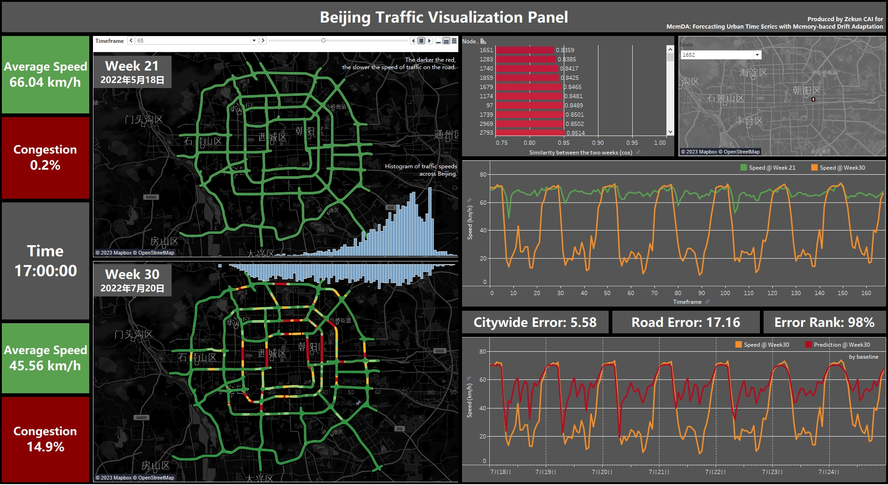

# [CIKM23] MemDA: Forecasting Urban Time Series with Memory-based Drift Adaptation

This repository contains the official code and datasets presented in our paper, "MemDA: Forecasting Urban Time Series with Memory-based Drift Adaptation," accepted by the 32nd ACM International Conference on Information and Knowledge Management (CIKM '23).

[Read the CIKM23 proceeding paper here or arxiv](https://dl.acm.org/doi/abs/10.1145/3583780.3614962). [](https://arxiv.org/abs/2309.14216)

## Dataset Description

We collected data from four cities covering different data sources and concept drift types. The PeMS and Beijing datasets are collected from the traffic speeds of major roads in California and Beijing. The Electricity dataset contains the electricity consumption. And the COVID-CHI dataset is the demand for shared bicycles collected from Chicago.

**Data Information**:

| **Dataset**    | Time Period           | Train/Test Split | Node | Temporal |
|----------------|-----------------------|------------------|------|----------|
| **PeMS**       | 2020/01/01~2020/07/31 | 2020/03/01       | 325  | 5 minutes|
| **Beijing**    | 2022/05/12~2022/07/25 | 2022/06/06       | 3126 | 5 minutes|
| **Electricity**| 2012/01/01~2012/06/30 | 2012/04/01       | 370  | 1 hour   |
| **COVID-CHI**  | 2019/07/01~2020/12/31 | 2020/03/01       | 112  | 2 hour   |

**Data Presentation**:

Macro presentation of the Beijing dataset:


Basic data analysis with jupyter notebook:

[data_describe.ipynb](./data_describe.ipynb) 

**File Format**:
- The data is provided in data.csv, with each row representing a timestamp and each column representing a node.
- For graph-structured data, we also provide an adjacency matrix file in adj.pkl.

## Usage

To use the model for forecasting, follow the command below:

```bash
python pred_MemDA.py
```

The `pred_MemDA_beijing.py` is singled out because the Beijing dataset is too large to load into the GPU.

Note that small datasets are known to be sensitive to the initialization of Replay Memory, so we recommend using the plain version of MemDA `pred_MemDA_Plain.py` on small datasets for more stable results.

### Custom Encoder

MemDA features integration with diverse existing time series forecasting models. We primarily utilized GraphWaveNet in our experiments. However, you can easily switch to a more powerful encoder to achieve superior results.

To integrate your custom encoder:

1. Place your encoder file in the directory: `./code/encoder/`.
2. In the `MemDA.py` file, update the `memda_net` class to call your custom encoder.

**Input/Output Specifications:**
- **Input Shape**: The encoder should receive data with the shape `(Batch, Channel, Node, TIMESTEP_IN)`.
- **Output Shape**: It should output the embedding result in the format `(Batch, encoder_dim, Node, 1)`.

### Parameters & Configuration

You can implement different configurations by modifying the parameters in the `./setting/Param.py` file.
Here's a detailed description of the parameters:

- `DATA_SET`: Specify which dataset to use, including PeMS20/Beijing/Electricity/COVID-CHI.
- `GPU`: Specify which GPU to use.
- `encoder`: Specify which encoder to use, including gwn.
- `encoder_dim`: Dimension of the embedding output by the encoder.
- `look_back`: Number of trackback days for the drift embedding of the model.
- `mem_num`: Number of Pattern Memory.
- `mem_dim`: Dimension of Pattern Memory.
- `ntn_dim`: Dimension of NTN layer.
- `ntn_k`: K of NTN layer.

### Dependencies

The program is executed under python 3.8 based on the `requirements.txt` library.

## Repository Structure

```
├── code
│   ├── encoder
│   │   └── Encoder_GWN.py
│   ├── setting
│   │   ├── Dataset_Setting.py
│   │   └── Param.py
│   ├── utils
│   │   ├── Metrics.py
│   │   └── Utils.py
│   ├── MemDA.py
│   ├── pred_MemDA.py
│   ├── pred_MemDA_beijing.py
│   └── pred_MemDA_Plain.py
└── data
    ├── Beijing
    ├── COVID-CHI
    ├── Electricity
    └── PeMS20
```

## Citation

If you find our work useful, please cite the following:

```  
@inproceedings{cai2023memda,
  title={MemDA: Forecasting Urban Time Series with Memory-based Drift Adaptation},
  author={Cai, Zekun and Jiang, Renhe and Yang, Xinyu and Wang, Zhaonan and Guo, Diansheng and Kobayashi, Hill Hiroki and Song, Xuan and Shibasaki, Ryosuke},
  booktitle={Proceedings of the 32nd ACM International Conference on Information and Knowledge Management},
  pages={193--202},
  year={2023}
}
```

## License

This project is licensed under the MIT License - see the [LICENSE](LICENSE) file for details.
